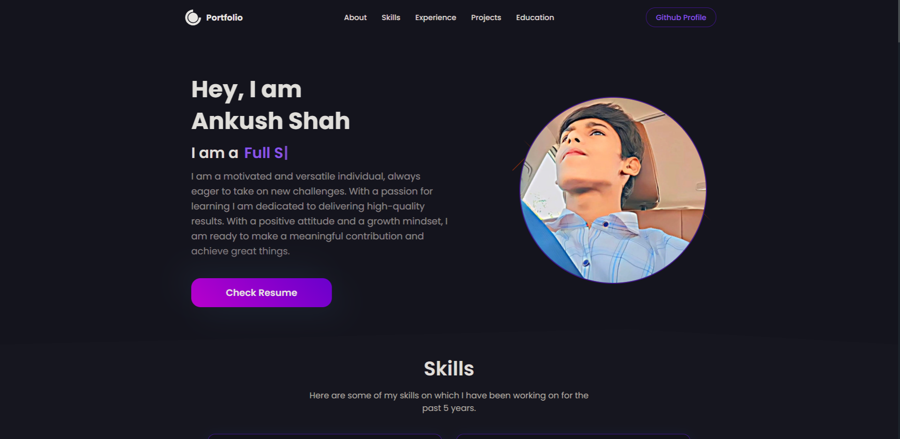

### Portfolio

Welcome to this portfolio web application! Comprehensive digital showcase of professional journey, encapsulating skills, projects, experiences. The portfolio is meticulously designed to provide visitors with an engaging and informative experience, allowing them to explore work, understand capabilities, and learn more about as a professional.

### Preview



### <a name="table">Table of Contents</a>

1. [Tech Stack](#tech-stack)
2. [Features](#features)
3. [Getting Started](#getting-started)
4. [Feedback](#feedback)
5. [Contributors](#contributors)

### <a name="tech-stack">Tech Stack</a>

- React.js
- JavaScript
- HTML5
- CSS3
- Node.js
- NPM
- Tailwind CSS

### <a name="features">Features</a>

- **Responsive Design:** The portfolio is fully responsive, ensuring optimal viewing on devices of all sizes.

- **Resume Attached:** Links to my professional social media profiles for easy access.

- **About Me:** Little Introduction.
  
- **Skills Section:** Lists my core skills and proficiencies, categorized for easy reference.

- **Projects Showcase:** Displays detailed information about my key projects, including images, descriptions, technologies used, and links to live demos or repositories.
  
- **Education:** A brief introduction to my educational background, and my professional journey.
  
- **Contact Form:** A simple and secure form allowing visitors to get in touch with me directly through the website.
  
- **Social Media Integration:** Links to my professional social media profiles for easy access.

### <a name="getting-started">Getting Started</a>

### Prerequisites

- [Git](https://git-scm.com/)
- [Node.js](https://nodejs.org/en)
- [npm](https://www.npmjs.com/) (Node Package Manager)

### Cloning

1. **Cloning:** 

    Run the following command in your terminal or command prompt to clone the repository to your local machine:

    ```bash
    git clone https://github.com/theankushshah/Ankushshah.git
    ```

2. **Navigate to the Directory:** 
    
    Once cloned, navigate into the project directory using the `cd` command:

    ```bash
    cd Ankushshah
    ```

### Download

1. **Download ZIP Code folder:** 

    Unzip the folder in your machine.

2. **Navigate to the Downloaded Directory:** 

    Open your code editor and open the unzipped folder in it then:

    ```bash
    cd /path/to/downloaded/folder
    ```

### Cloning & Download

1. **Dependencies Installation:**

    ```bash
    npm install
    ```

2. **Running:**

    ```bash
    npm run dev
    ```

    Open [http://localhost:3000](http://localhost:3000) in your browser to view the project.

3. **Start Coding:** 

    Feel free to edit the code according to your requirements. 

4. **Testing**

    ```bash
    npm test
    ```

5. **Build for Production**

    ```bash
    npm run build
    ```

### Github

1. **Initialize a New Git Repository:**

    ```bash
    git init
    ```

2. **Stage and Commit the Code:**

    ```bash
    git add .
    git commit -m "Initial commit"
    ```

3. **Create a New Repository on GitHub:**

    Do not initialize the new repository with a README, .gitignore, or license.

4. **Link Local Repository to GitHub:**

    ```bash
    git remote add origin https://github.com/username/new-repo.git
    ```

    Replace https://github.com/username/new-repo.git with your actual repository URL.

5. **Push Code to GitHub:**

    ```bash
    git branch -m main
    git pull origin main
    git push -u origin main
    ```

6. **Deployment:** 
    
    Deploy the application to your preferred hosting platform to make it accessible online.

### Forking

1. **Forking:** 

    Run the following command in your terminal or command prompt to fork the repository to your local machine:

    ```bash
    git clone https://github.com/your-username/Ankushshah.git
    ```

2. **Navigate to the Directory:** 

    Once cloned, navigate into the project directory using the `cd` command:

    ```bash
    cd Ankushshah
    ```

3. **Start Coding:** 

    Make the additions & desired changes to the code.

4. **Commit & Push Your Changes to Your Fork:** 

    Once cloned, navigate into the project directory using the `cd` command:

    ```bash
    git add .
    git commit -m ""
    git pull origin main
    git push -u origin main
    ```

5. **Create a Pull Request:**

- Go to your forked repository on GitHub
- Click the "Compare & pull request" button.
- Review your changes and write a clear description of your contribution.
- Click "Create pull request"

    **I will review your pull request and decide whether to merge your changes into my repository or not**

### <a name="feedback">Feedback</a>

You might encounter some bugs while using this app. You are more than welcome to contribute. Just submit changes via pull request and I will review them before merging. Make sure you follow community guidelines.

### <a name="contributors">Contributors & Main</a>

- Ankush Shah (ankushsahvlogs@gmail.com)
- Haven Futures (support@havenfutures.com) (Main)

Happy coding!